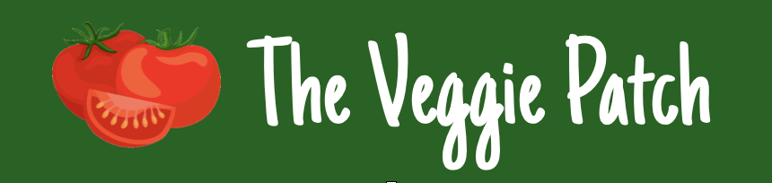

# The Veggie Patch

As my Milestone Project 3 for the Code Institute Full Stack Web Development course,
I have built an application where people are able to find and share vegetarian recipes with each other.

The application can be found at ....

## UX
The application is meant to be a platform for people who are interested in vegetarian cooking,
to get inspired and find and share recipes with each other.\
Data for the app is kept in a MongoDB document-based database with two collections.\
The app incorporates the four basic CRUD (create, read, update, delete) functions, and it was created using HTML, Flask, Jinja templating and CSS.

### User stories

### Wireframes

### Database

## Features

### Existing Features

### Features Left to Implement

## Technologies and Tools Used

## Testing

## Deployments

## Credits

### Content and Media
- Landing page background photo is from [Pexels](https://www.pexels.com/)
- Recipes including photos are from the [BBC goodfood](https://www.bbcgoodfood.com/) website

### Acknowledgments

